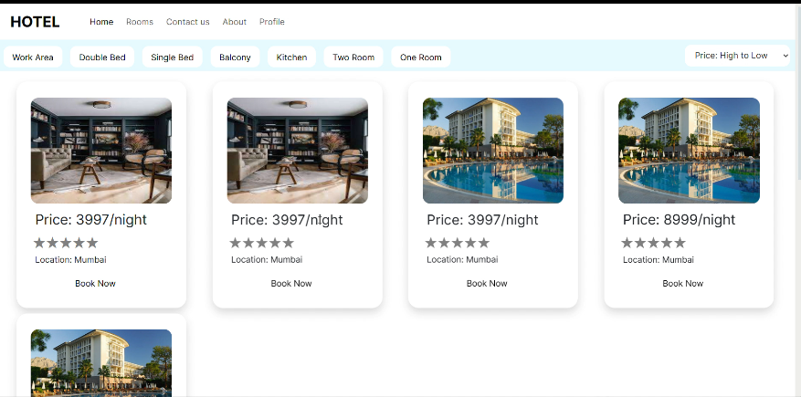
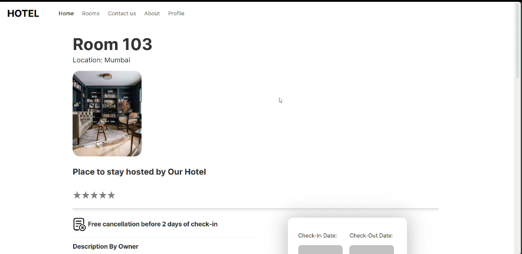
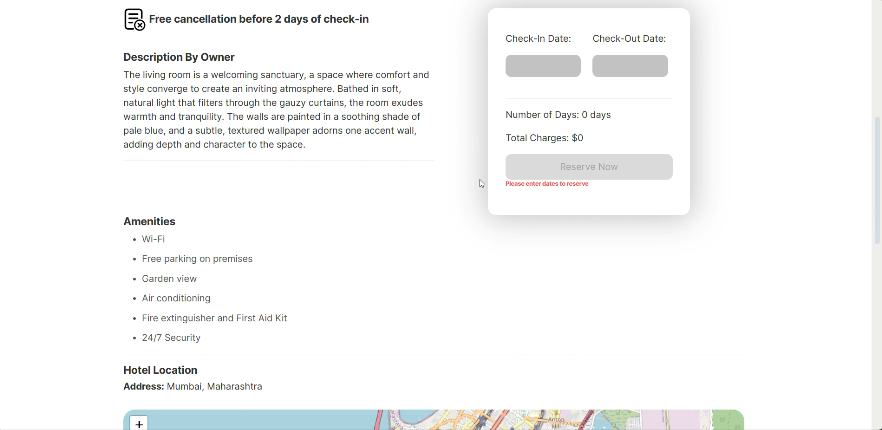
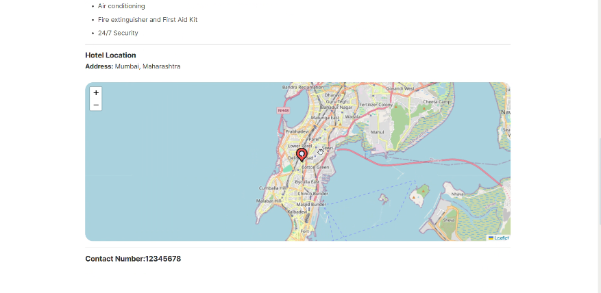

## HOTEL BOOKING WEBSITE ( MERN STACK )

##### Contributers:

- Nirmiti Rane ([@nirmitirane24](https://github.com/nirmitirane24))  
- Pranav Patil 

### How to run this app ?

##### RUN BACKEND:

1. Add a your databse link for mongoDB 

2. `node app.js from backend`

#### RUN FRONTEND:

1. `npm run hotel-booking-frontend`

##### PHOTOS AND VIDEOS:

  

  

  

  

  

- VIDEO IS AVAILABLE IN VIDEO FOLDER

